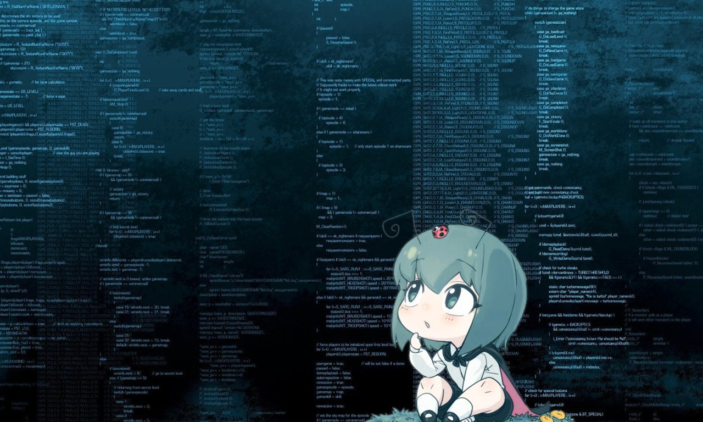

<h1>
  

    <i
      >
      Hi, I'm Shreyansh
      
    </i>
  

</h1>

  

** About Me:**

- Doing my Bachelor in "Computer Scinece and Engineering";
- Creating new UI renders every week at [UI/UX](https://github.com/shr3yy/UI-UX); 
- Trying to <i>merge</i> my life with ;
- On my way for *DevOps*;
- Work? Talk? Suggestions? : shreyanshmalvya@gmail.com ;

**👨🏻‍💻 Languages and Tools:**  

<code></code>
<code></code>
<code></code>
<code></code>
<code></code>
<code></code>
 
 
 Wanna Connect?  
  &nbsp;
  &nbsp;
  &nbsp;
  &nbsp;

---
## Artifacts

<!-- 
  &nbsp;&nbsp;
 -->

### Show some ❤️ by starring some of the repositories!

---
